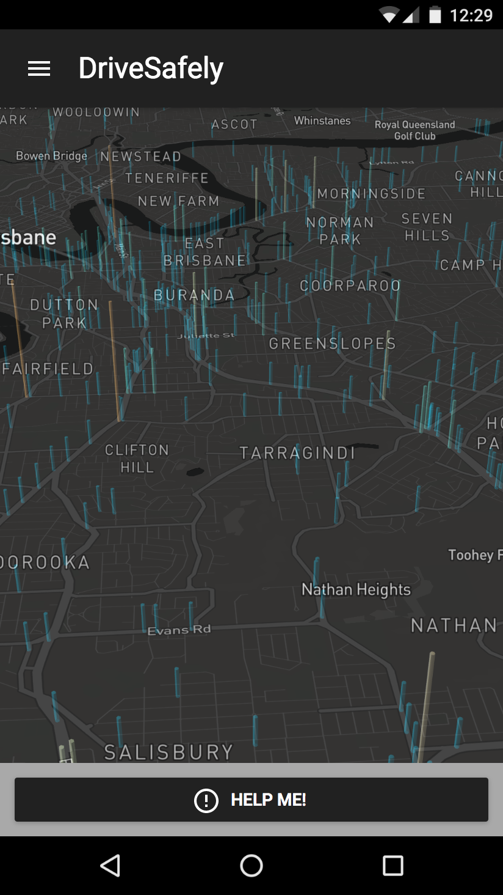

# DriveSafely

_Drive Safely_ is a web based app for both mobile and desktop devices. It allows users to plan the safest route possible and assist them if they are in a roadside incident. 

_Drive Safely_ is designed for use by any driver in Brisbane, however its safety features make it most attractive to drivers who are unfamiliar with Brisbane roads and the Australian insurance process. This includes learner drivers, families with young children and cautious drivers.
